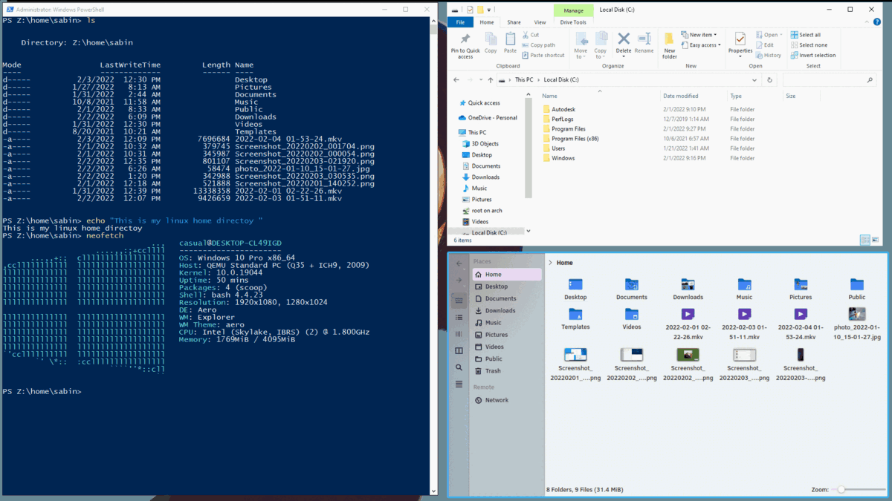

#   Cassowary 

[](https://github.com/casualsnek)



With Cassowary you can run a Windows virtual machine and use Windows applications on Linux as if they were native applications, built upon FreeRDP and remote apps technology.

**If you prefer a setup guide video instead of a wall of text, [click here.](https://www.youtube.com/watch?v=ftq-c_VgmK0)**

Please give a star ⭐ or follow this project if you find it useful.

## Cassowary supports:
 - Running Windows application as if they were native application
 - Opening files from a Linux host directly inside Windows applications
 - Using Linux apps to open files that are on a Windows VM
 - Allowing easy access between both the guest and host filesystems
 - An easy-to-use configuration utility
 - Creating an application launcher for Windows application
 - Automatically suspending the VM when no Windows application is in use and automatically resume it when required (virt-manager only)

## This README consists of instructions for:
1. [Setting up a Windows VM with virt-manager](docs/1-virt-manager.md)
2. [Installing Cassowary on a Windows guest and Linux host](docs/2-cassowary-install.md)
3. [Extra How to's and FAQ](docs/3-faq.md)

* Building Cassowary from source
* How can I help?

<br>


## Building Cassowary from source
This step is necessary ONLY if you don't want to use the releases from the [release page](https://github.com/casualsnek/cassowary/releases) and you want to build the `.zip` and the `.whl` files by yourself!

Install [wine](https://wiki.winehq.org/Download) first, in order to build Windows application on Linux. Internet access is required to download the python binary for setup. 

```
$ git clone https://github.com/casualsnek/cassowary
$ cd cassowary
$ ./buildall.sh
```
If `buildall.sh` produces an error such as `bash: ./buildall.sh: Permission denied`, run this command:
```
chmod +x buildall.sh
```
and then run the following again:
```
./buildall.sh
```

This will create a `dist` folder inside `app-linux` which contains the installable wheel file.  
A `bin` folder will also be created inside `app-windows` containing the setup files for Windows.

## How can I help?
- Improve the README.md and/or the documentation
- Report bugs or submit patches
- Suggest new features or improvements on existing ones!
