# 1. Setting up Windows vm with virt-manager and KVM

This will help you set up an efficient virtual machine for use with cassowary.

The instructions are written mainly for Arch Linux, so be sure to adapt them to the distro you are using!

### We start by installing virt-manager and KVM

```bash
$ sudo pacman -S virt-manager
```

### Making KVM run without root access

```bash
$ sudo sed -i "s/#user = \"root\"/user = \"$(id -un)\"/g" /etc/libvirt/qemu.conf
$ sudo sed -i "s/#group = \"root\"/group = \"$(id -gn)\"/g" /etc/libvirt/qemu.conf
$ sudo usermod -a -G kvm $(id -un)
$ sudo usermod -a -G libvirt $(id -un)
$ sudo systemctl restart libvirtd
$ sudo ln -s /etc/apparmor.d/usr.sbin.libvirtd /etc/apparmor.d/disable/
```

### Making network available with AppArmor enabled

On some Linux distribution if AppArmor is enabled it is necessary to modify the file `/etc/apparmor.d/usr.sbin.dnsmasq` to be able to connect to the network or virt-manager will throw a segmentation fault.

If you can't find the `dnsmasq` profile, be sure to install every additional packages regarding AppArmor profiles.  
If you can't still find the `dnsmasq` profile, you can always download it from from [AppArmor gitlab](https://gitlab.com/apparmor/apparmor/-/blob/master/profiles/apparmor.d/usr.sbin.dnsmasq) and copy it to the right location:

```bash
$ wget https://gitlab.com/apparmor/apparmor/-/blob/master/profiles/apparmor.d/usr.sbin.dnsmasq -O ~/usr.sbin.dnsmasq
$ sudo mv ~/usr.sbin.dnsmasq /etc/apparmor.d/
```

Now, to modify the main profile, you will have to add a `r` at the end of the line about `libvirt_leaseshelper` , so it will be like: `/usr/libexec/libvirt_leaseshelper mr,`.

This can also be done via terminal:

```bash
$ sudo sed -i "s/\/usr\/libexec\/libvirt_leaseshelper m,/\/usr\/libexec\/libvirt_leaseshelper mr,/g" /etc/apparmor.d/usr.sbin.dnsmasq
```

Remember that those changes should be repeated on every AppArmor update.

### Create libvirt.conf

On some Linux distribution is better to create a config file to make sure the default libvirt uri is the system one.

To do this create the folder `~/.config/libvirt/` and inside this folder create the `libvirt.conf` with `uri_default = "qemu:///system"`

```bash
$ mkdir -p ~/.config/libvirt
$ echo "uri_default = \"qemu:///system\"" >> ~/.config/libvirt/libvirt.conf
```

Now you will need to restart for all the changes to take place.

### Download Windows .iso image and VirtIO Drivers for Windows

We will need either Windows 7, 8, or 10 Pro, Enterprise or Server to use RDP apps.  
VirtIO driver will improve the VM performance while having lowest overhead.

> **BE SURE TO USE AN ADBLOCK FOR THE SITE BELOW!**  
> Download links are generated directly from Microsoft CDN, so they are totally legit.

- Download Windows isos from: [HERE](https://tb.rg-adguard.net/public.php)

- Download latest VirtIO driver iso images from: [HERE](https://fedorapeople.org/groups/virt/virtio-win/direct-downloads/stable-virtio/virtio-win.iso)

> If you are using Windows 7 you don't need to download VirtIO iso as it is not supported.

and save them in a convenient location.

### Creating a Virtual Machine

- Open virt-manager from your application menu

- On virt-manager click on **Edit** -> **Preferences**, check **Enable XML editing** then click Close;  
  
  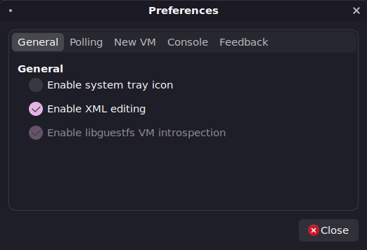

- From virt-manager menu bar select **File** and then **New Virtual Machine**;

- On the New VM window select **Local Install media** and click Next;  
  
  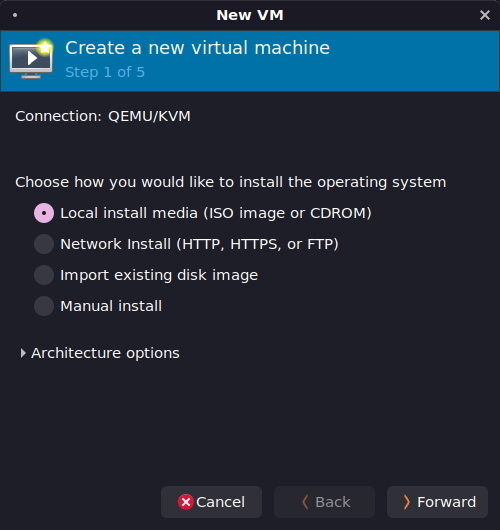

- Browse and select the Windows 10 iso you downloaded on install media then click Next again;

- Set the CPU cores (2 recommended), Memory (4096 MB recommended) and Disk Space as per your preferences;  
  
  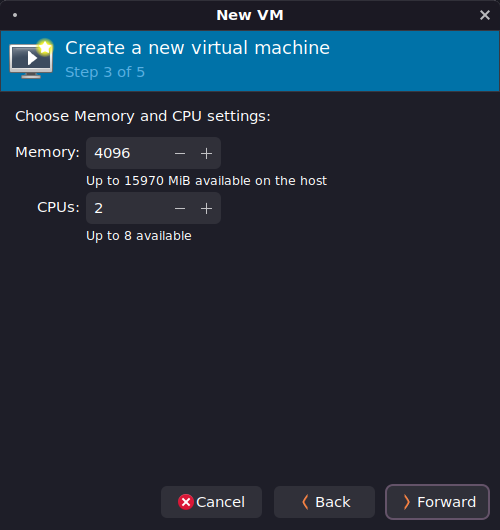
  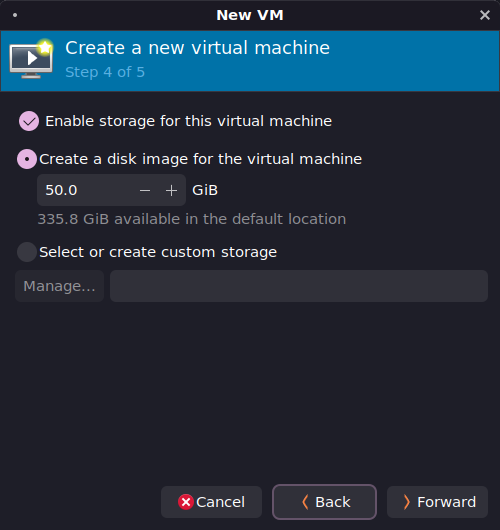

- Give a name to your vm such as `Win10` and check **Customize configuration before install** then click on Finish!;  
  
  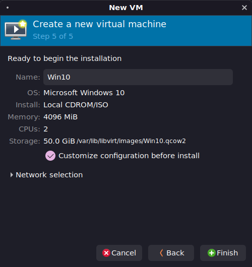

- In the CPU tab make sure **Copy host configuration** is checked;  
  
  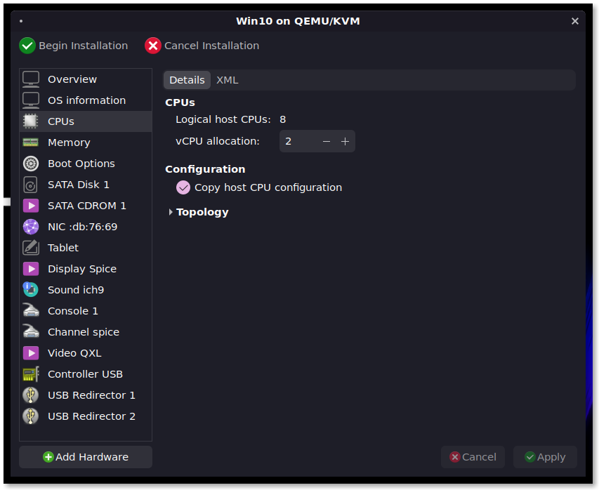

- Goto XML tab of CPU and replace the section:

```xml
<clock offset="localtime">
    .......
    .......
</clock>
```

with:

```xml
<clock offset="localtime">
  <timer name="hpet" present="yes"/>
  <timer name="hypervclock" present="yes"/>
</clock>
```

- In the Memory tab set the **Curent allocation** to **1024**, so the VM won't use 4GiB of memory directly but it will range from 1GiB to 4GiB;  
  
  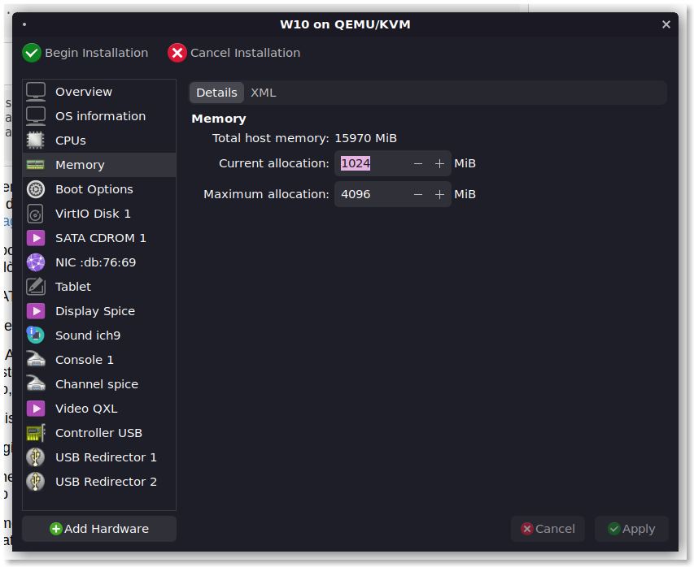

- In the Boot Options tab you could check **Start the virtual machine on host bootup** if you would like the VM to boot automatically at your PC boot;

- In the SATA Disk 1 tab set the **Disk bus** to **VirtIO**;  

> If you are using Windows 7 skip this step as VirtIO is not supported.

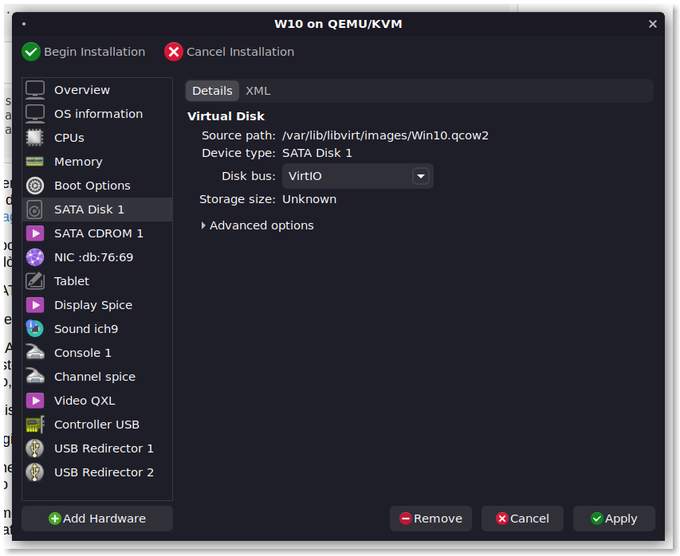

- Move over to NIC section and set **Device Model** to **virtio**;  
  
  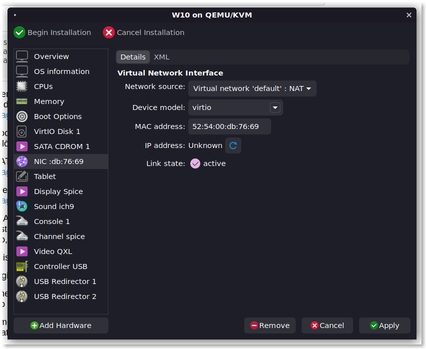

- Click on **Add hardware** at the bottom left, select **Storage** then choose **Select or Create custom storage**; click on **Manage**, browse and select the downloaded virtio-win driver iso. Finally set the device type to **CDROM** and click on Finish;  
  
  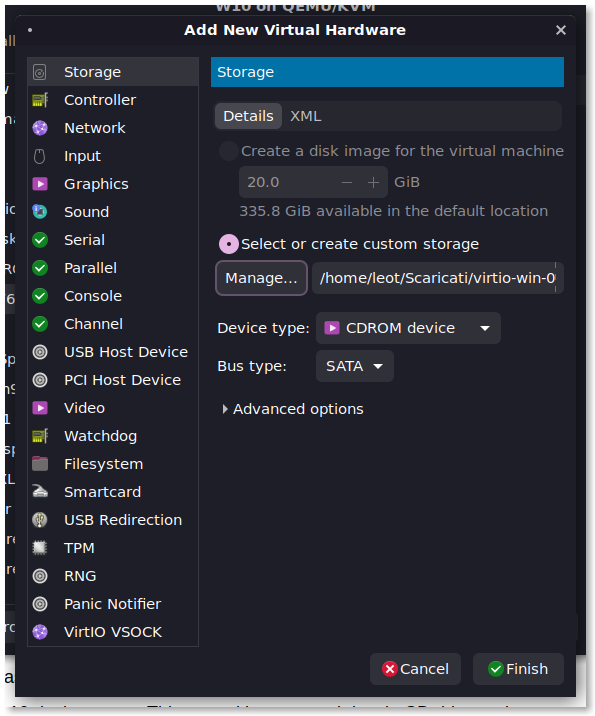

- Click **Begin Installation** on top left;

- Follow the installation instructions for Windows 10 and when choosing a Custom installation you will get no drives to install Windows 10 on. To make the VirtIO drive works you will have to click on **Load Driver**, then choose **OK** and finally select the driver for Windows 10;

> If no drivers are loaded or shown, let Windows search for them inside the `amd64` folder of the VirtIO disk.

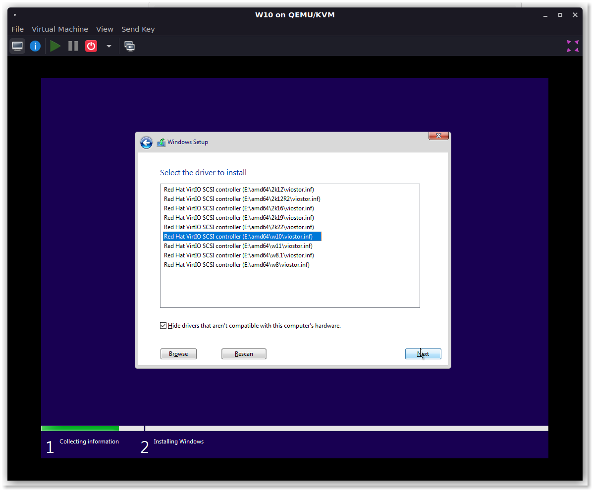

- After that your drive will show and you can continue like a normal Windows 10 installation;
- After some time you will get to "Let's connect to internet page", click on **I dont have internet** at bottom left and continue with limited setup;
- Set you username and password. The Password is not allowed to be blank;
- After you get to Windows 10 desktop open This PC and browse to virtio-win CD drive and install **virtio-win-gt-x64.exe**;
- It's also suggested to install the [spice guest tools](https://www.spice-space.org/download/windows/spice-guest-tools/spice-guest-tools-latest.exe) to also enable copy-paste between host and guest;
- Shut down the VM and from the menu bar select **View** and then **Details**;
- Go to Display Spice section and set **Listen Type** to **None**; also check the OpenGL option and click Apply;
- Go to Video QXL section and set **Model** to **VirtIO** and check the 3D acceleration option;

> If after those two changes all you get is a black screen, revert those changes. This could happen with nVidia graphics card;

- Start the VM by clicking the play button on top left (you may need to click the Monitor icon to show the VM screen ). Login to desktop;
- Open up edge and browse to this page and continue the instructions for installing cassowary.

---

Note: For better 3D performance you can use VmWare or other virtualization platform, ( The IP autodetection and VM auto suspend only works for libvirt based platforms as of now.

---

**Next guide** -> [Installing cassowary on Windows guest and Linux host](2-cassowary-install.md)
